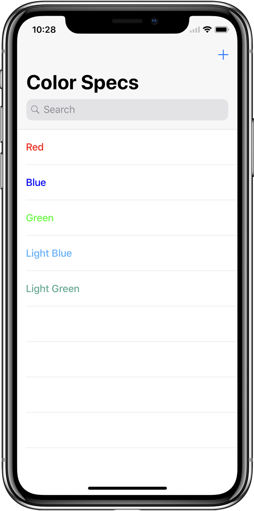
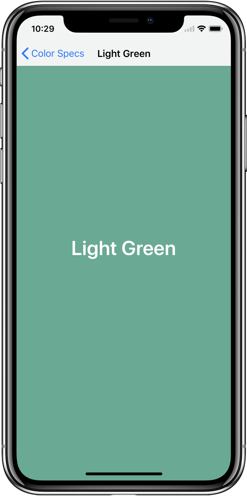
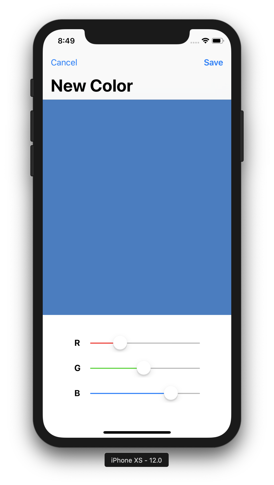
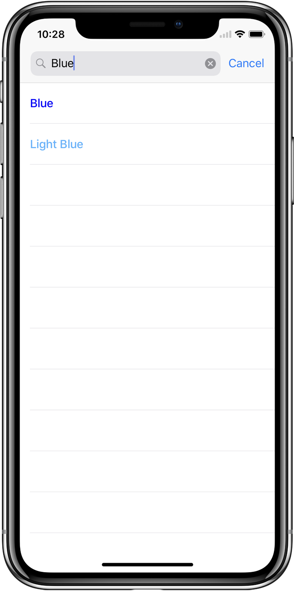

# Color Spec
### Kay Yin (Adopted From Brian Wang's Color Spec Sample Code)
#### For October 17th, 2017 meeting

Kay teaches how to build apps with multiple screens. This is useful as it lets you build apps that are more complex than what we've already done.

Screenshots:

