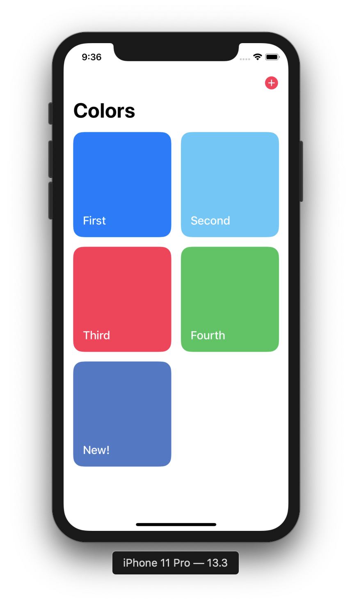
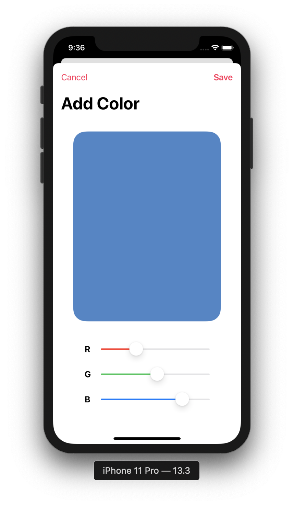
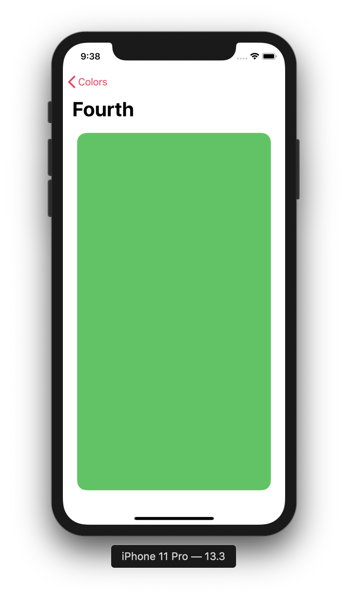
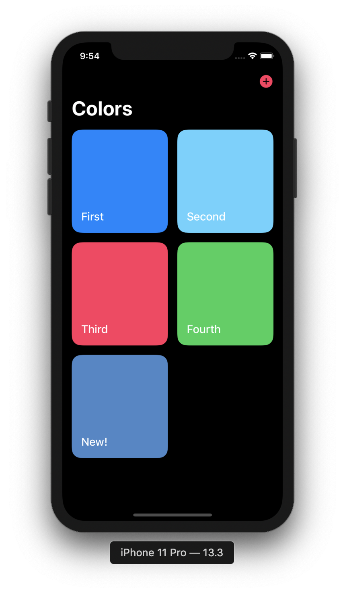
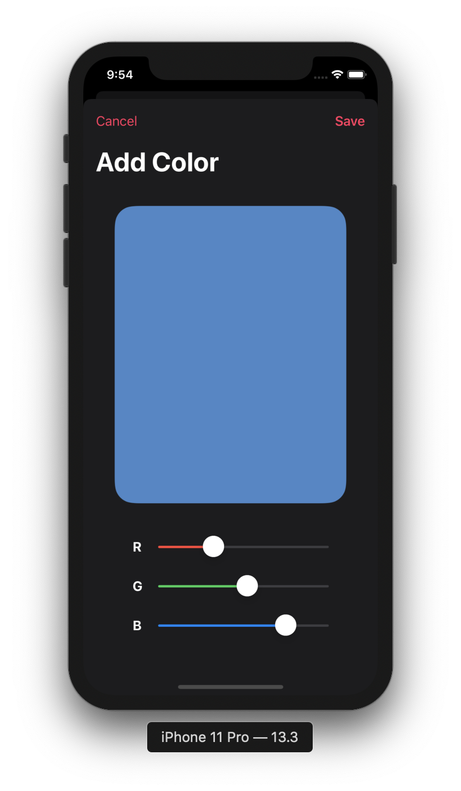
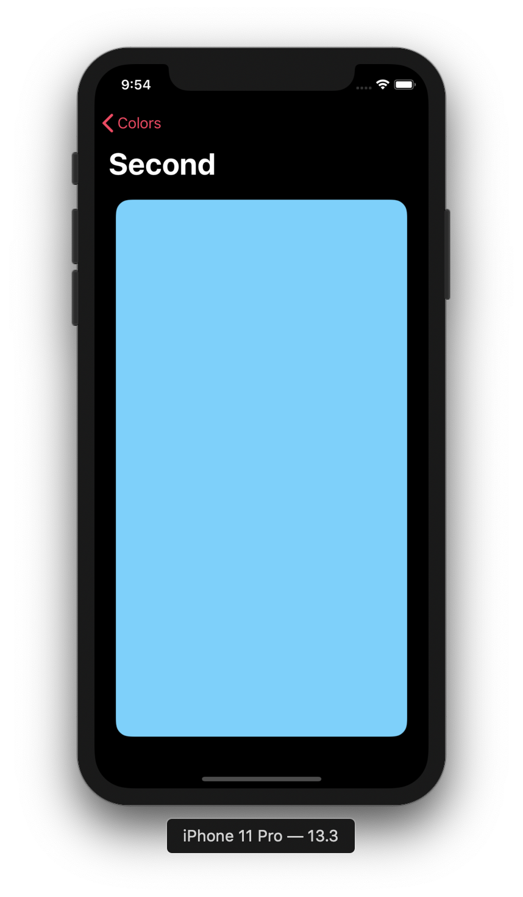

# Colors
#### Meeting of February 18, 2020

This app features color saving & viewing using multiple View Controllers. Using more than one View Controller lets you build apps that are more complex than what we've done before. Colors includes:
* A primary collection view controller to explore all saved colors
* A view controller that allows the user to customize and save a new color, presented modally
* A detail view controller that fills the screen with a chosen color, presented in the navigation stack
* Dependency injection for the view controller presentations via both segues and a static presentation method

### App Screenshots:

